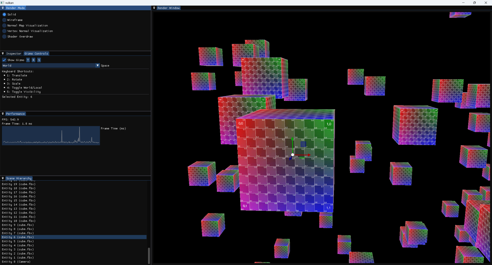

## Screenshots



### Features

**Core Graphics**

- Cross-platform rendering with DX12 and Vulkan backends
- Modern rendering pipeline with multiple passes (base, debug, final)
- Various visualization modes (solid, wireframe, normal map visualization, vertex normal visualization, shader overdraw)
- Material and texture management

**Architecture**

- Entity Component System (ECS) architecture
- Scene management system
- Service locator pattern

**Editor Features**

- Comprehensive ImGui-based editor (not just for debugging)
- Scene view and hierarchy panel showing the scene structure
- Performance monitoring with FPS display and graphs
- Object inspector for manipulating entity properties (translation, rotation, scale)
- Gizmo tools for visual transformation of objects
- Shader mode selection panel for switching between different visualization modes
- Input control legend for camera movement and speed adjustment

**Tooling**

- Hot-reload system with file watcher (WIP - shader reload)
- Support for seamless switching between editor and game modes
- Comprehensive logging system with multiple backends (console, file, memory)
- Configuration system

**Asset Pipeline**

- Model loading via Assimp
- Image loading with multiple backends (DirectX Tex, STB)
- Resource management for models, meshes, textures, and materials

**Additional Features**

- Event system (window, keyboard, mouse, application events)
- Input management
- Memory management and allocation
- Time measurement and management

### How to build

I strongly recommend creating a separate build directory and building the project there. This approach makes it easy to clean up build-related files and folders, ensuring that they do not clutter the root directory.

1. **Clone the repository**
   Open your terminal and clone the repository to your local machine:

   ```bash
   git clone git@github.com:vadymchan/game_engine.git
   ```

2. **Create a build directory** (optional but recommended)
   It’s a good practice to keep build files separate from source code. Create and navigate to the build directory:

   ```bash
   cd game_engine
   mkdir build
   cd build
   ```

3. **Configure the project using CMake**
   Configure the project with CMake to generate the necessary build files.
   If you’re using a command-line interface, simply run:

   ```bash
   cmake ..
   ```

   You can also customize the build by enabling or disabling specific options. For example, to enable DirectX as the rendering API, run:

   ```bash
   cmake -DUSE_DIRECTX=ON ..
   ```

   Alternatively, you can use the CMake GUI for a more user-friendly experience:

   - Open the CMake GUI.
   - Set the source directory to the root of the cloned repository.
   - Set the build directory to your preferred location (e.g., `game_engine/build`).
   - Click "Configure" and choose your preferred generator (e.g., Visual Studio, Ninja, Unix Makefiles).
   - Optionally, you can modify available CMake options. Here are the most common ones:
     **Third‑party libraries:**

   - `BUILD_SDL` (default: ON)
   - `BUILD_GLFW` (default: OFF)
   - `BUILD_SPDLOG` (default: ON)
   - `BUILD_BULLET` (default: OFF)
   - `BUILD_IMGUI` (default: ON)
   - `BUILD_ASSIMP` (default: ON)
   - `BUILD_STB` (default: ON)
   - `BUILD_BOOST` (default: OFF)
   - `BUILD_EIGEN` (default: OFF)
   - `BUILD_MATH_LIBRARY` (default: ON)
   - `BUILD_EASTL` (default: ON)
   - `BUILD_XXHASH` (default: ON)
   - `BUILD_RAPIDJSON` (default: ON)
   - `BUILD_WATCHER` (default: ON)
   - `BUILD_ENTT` (default: ON)

   **Rendering API selection:**

   - `USE_VULKAN` (default: ON)
   - `USE_OPENGL` (default: OFF)
   - `USE_DIRECTX` (default: \${WIN32})

   **Dependent and auxiliary options:**

   - `BUILD_VULKAN_MEMORY_ALLOCATOR` (ON if `USE_VULKAN`)
   - `BUILD_D3D12_MEMORY_ALLOCATOR` (ON if `USE_DIRECTX`)
   - `USE_DIRECTX_AGILITY` (ON if `USE_DIRECTX`)
   - `USE_DIRECTX_TOOL_KIT` (ON if `USE_DIRECTX`)
   - `BUILD_IMGUIZMO` (ON if `BUILD_IMGUI`)
   - `USE_DIRECTX_SHADER_COMPILER` (default: ON)
   - `USE_DIRECTX_TEX` (default: ON)

- Click "Generate" to create the build files. to create the build files.

4. Launch the project
   Once the build files are generated, you can open and run the project in your IDE. Below are the steps for Visual Studio 2022: 5. Open the solution file
   Double‑click `game_engine.sln` in the build directory, or choose File > Open > Project/Solution and select it. 6. Set the startup project
   In the Solution Explorer, right‑click the `GameEngine` project and choose Set as Startup Project (its name will appear in bold). 7. Build and run
   - To build: select Build > Build Solution or press `Ctrl+Shift+B`.
   - To run: press `F5` or click the Start button. Visual Studio will build the project first if needed and then launch the application.

### How to switch modes

To change between **Game** and **Editor** modes or switch the rendering API, follow these steps:

1. Open the configuration file
   Navigate to `config/debug/config.json` in your build directory.
2. Set the rendering API
   Find the `"renderingApi"` field and set its value to either:
   - `"vulkan"`
   - `"dx12"`
3. Set the application mode
   Find the `"applicationMode"` field and set its value to either:
   - `"game"`
   - `"editor"`
4. Save and launch
   Save your changes and start the application as described in the Launch the project section above.

### Dependencies

- [SDL](https://github.com/libsdl-org/SDL.git)
- [spdlog](https://github.com/gabime/spdlog.git)
- [ImGui](https://github.com/ocornut/imgui.git)
- [ImGuizmo](https://github.com/CedricGuillemet/ImGuizmo.git)
- [Assimp](https://github.com/assimp/assimp.git)
- [stb](https://github.com/nothings/stb.git)
- [math_library](https://github.com/vadymchan/math_library) - custom math library specifically designed for game engine needs, utilizing SIMD for vector and matrix operations, quaternions for rotation, and utility functions for view/projection matrices and other game-specific math operations
- [RapidJSON](https://github.com/Tencent/rapidjson.git)
- [Watcher](https://github.com/e-dant/watcher.git)
- [EnTT](https://github.com/skypjack/entt.git)
- [Vulkan Memory Allocator](https://github.com/GPUOpen-LibrariesAndSDKs/VulkanMemoryAllocator.git)
- [vcpkg-cmake-integration](https://github.com/bitmeal/vcpkg-cmake-integration.git) - adds local vcpkg. Currently used for taking DirectX libraries.
- [D3D12 Memory Allocator](https://github.com/GPUOpen-LibrariesAndSDKs/D3D12MemoryAllocator.git)
- [DirectX Shader Compiler ](https://vcpkg.link/ports/directx-dxc)
- [DirectX Tex ](https://vcpkg.link/ports/directxtex)
- [cmake-modules](https://github.com/rpavlik/cmake-modules) (FindWindowsSDK) - - for locating and integrating the Windows SDK in the project.
- .clang-tidy and .clang-format

## naming conventions for this project:

For refactoring naming conventions this project uses **clang-format**.

| Code Element                     | Naming Convention                                 | Example                                  |
| -------------------------------- | ------------------------------------------------- | ---------------------------------------- |
| Classes                          | CamelCase                                         | `GameEngine`                             |
| Structures                       | CamelCase                                         | `Vector2D`                               |
| Unions                           | CamelCase                                         | `DataUnion`                              |
| Functions / Methods              | camelCase with `g_` prefix (for global functions) | `updatePosition()`, `g_initializeGame()` |
| Public Member Variables          | `m_` prefix + camelCase                           | `m_position`                             |
| Private Member Variables         | `m_` prefix + camelCase + `_` postfix             | `m_position_`                            |
| Protected Member Variables       | `m_` prefix + camelCase + `_` postfix             | `m_counter_`                             |
| Public Methods                   | camelCase                                         | `updatePosition()`                       |
| Protected Methods                | camelCase + `_` postfix                           | `run_()`                                 |
| Private Methods                  | camelCase + `_` postfix                           | `initialize_()`                          |
| Enums (both scoped and unscoped) | CamelCase                                         | `Color`                                  |
| Enum Constants                   | CamelCase                                         | `Difficulty::Easy`                       |
| Namespaces                       | lowercase with underscores                        | `game_logic`                             |
| Interface Classes                | `I` prefix + CamelCase                            | `ICollidable`                            |
| Template Parameters              | CamelCase                                         | `ContainerType`                          |
| Macros                           | UPPER_CASE_WITH_UNDERSCORES                       | `MAX_HEALTH`                             |
| Typedefs and Type Aliases        | CamelCase                                         | `BigInt`                                 |
| Static Constant Member Variables | `s_k` prefix + CamelCase                          | `s_kMaxValue`                            |
| Class Constant Member Variables  | `s_k` prefix + CamelCase                          | `s_kDefaultColor`                        |
| Constants                        | `k` prefix + CamelCase                            | `kMaxPlayers`                            |
| Static Variables                 | `s_` prefix + camelCase                           | `s_instanceCount`                        |
| Global Variables                 | `g_` prefix + camelCase                           | `g_gameState`                            |
| Global Constants                 | `g_k` prefix + CamelCase                          | `g_kInitialSpeed`                        |
| Class Members                    | `s_` prefix + camelCase                           | `s_memberVariable`                       |
| Class Methods                    | `s_` prefix + camelCase                           | `s_classMethod()`                        |
| Template Value                   | camelCase                                         | `defaultValue`                           |
| Type Template                    | CamelCase                                         | `TypeParam`                              |

P.S. for some elements i'm still not sure:

- for class methods do i really need to add `_s` prefix 🤔
- do i need to add `s_k`, `g_k` prefixes 🤔
