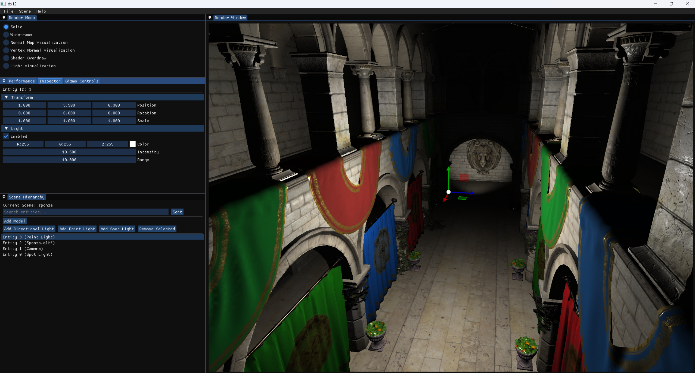

# ARISE
ARISE is:
**A**dvanced 
**R**endering 
**I**nterface & 
**S**andbox 
**E**ngine


A modern, cross-platform graphics engine built with C++20, designed following KISS, YAGNI, SoC, and SOLID principles. ARISE prioritizes simplicity and maintainability while delivering robust rendering capabilities across multiple graphics APIs.

## Screenshots




## Features

### Core Graphics

- Cross-platform rendering with DX12 and Vulkan backends
- Modern rendering pipeline with multiple passes (base, debug, final)
- Various visualization modes (solid, wireframe, normal map visualization, vertex normal visualization, shader overdraw)
- Material and texture management
- **GPU and CPU profiling support** with Tracy integration

### Architecture

- Entity Component System (ECS) architecture
- Scene management system
- Service locator pattern

### Editor Features

- Comprehensive ImGui-based editor (not just for debugging)
- Scene view and hierarchy panel showing the scene structure
- Performance monitoring with FPS display and graphs
- Object inspector for manipulating entity properties (translation, rotation, scale)
- Gizmo tools for visual transformation of objects
- Shader mode selection panel for switching between different visualization modes
- Input control legend for camera movement and speed adjustment
- File dialog support for loading assets

### Tooling

- Hot-reload system with file watcher (WIP - shader reload)
- Support for seamless switching between editor and game modes
- Comprehensive logging system with multiple backends (console, file, memory)
- Configuration system
- Offline asset conversion tools (gltfpack & toktx)
- PIX markers support for DirectX debugging

### Asset Pipeline

- Model loading via Assimp
- glTF 2.0 support with KTX2/BasisU textures
- Mesh optimization at runtime (EXT_meshopt decoder)
- MikkTSpace tangent generation
- Image loading with multiple backends (DirectX Tex, STB)
- Resource management for models, meshes, textures, and materials

### Additional Features

- Event system (window, keyboard, mouse, application events)
- Input management
- Memory management and allocation
- Time measurement and management
- Profiling infrastructure for performance analysis

## Building the Project

I strongly recommend creating a separate build directory and building the project there. This approach makes it easy to clean up build-related files and folders, ensuring that they do not clutter the root directory.

### Prerequisites

- CMake 3.26 or higher
- C++20 compatible compiler
- For DirectX: Windows SDK
- For Vulkan: Vulkan SDK

### Build Steps

1. **Clone the repository**

   ```bash
   git clone git@github.com:vadymchan/game_engine.git
   cd game_engine
   ```

2. **Create a build directory** (optional but recommended)

   ```bash
   mkdir build
   cd build
   ```

3. **Configure the project using CMake**

   Basic configuration:

   ```bash
   cmake ..
   ```

   With specific options:

   ```bash
   cmake -DUSE_DIRECTX=ON -DUSE_PROFILING=ON ..
   ```

### Build Options

#### Rendering APIs

- `USE_VULKAN` (default: ON) - Enable Vulkan support
- `USE_OPENGL` (default: OFF) - Enable OpenGL support (deprecated)
- `USE_DIRECTX` (default: ${WIN32}) - Enable DirectX 12 support
- `FORCE_RHI_API` (default: OFF) - Force specific RHI API at compile time

#### Core Libraries

- `BUILD_SDL` (default: ON) - SDL2 window management
- `BUILD_GLFW` (default: OFF) - GLFW window management
- `BUILD_SPDLOG` (default: ON) - Logging library
- `BUILD_BULLET` (default: OFF) - Physics engine
- `BUILD_IMGUI` (default: ON) - Dear ImGui UI library
- `BUILD_ASSIMP` (default: OFF) - Asset import library
- `BUILD_STB` (default: ON) - STB image loading
- `BUILD_MATH_LIBRARY` (default: ON) - Custom math library with SIMD
- `BUILD_ENTT` (default: ON) - Entity Component System

#### Asset Loading

- `USE_GLTF` (default: ON) - Enable glTF/KTX support
  - `BUILD_CGLTF` (default: ON) - cgltf parser
  - `BUILD_LIBKTX` (default: ON) - KTX2/BasisU loader
  - `BUILD_MESHOPTIMIZER` (default: ON) - Runtime mesh optimization
  - `BUILD_MIKK_T_SPACE` (default: ON) - Tangent space generation
- `USE_GLTF_SAMPLE_MODELS` (default: OFF) - Download glTF sample models

#### Profiling

- `USE_PROFILING` (default: OFF) - Enable profiling support
  - `BUILD_TRACY` (default: ON if profiling enabled) - Tracy profiler
  - `USE_CPU_PROFILING` (default: ON if profiling enabled)
  - `USE_GPU_PROFILING` (default: ON if profiling enabled)
  - `USE_TRACY_GPU_PROFILING` (default: ON if GPU profiling enabled)

#### Additional Tools

- `BUILD_ASSET_TOOLS` (default: OFF) - Build offline asset conversion tools
- `BUILD_IMGUIZMO` (default: ON) - ImGuizmo gizmo library
- `BUILD_IMGUIFILEDIALOG` (default: ON) - File dialog for ImGui
- `BUILD_WINPIX_EVENT` (default: ON on Windows) - PIX3 markers for debugging

#### Platform-Specific

- `USE_DIRECTX_AGILITY` (default: ON if DirectX) - DirectX 12 Agility SDK
- `USE_DIRECTX_TOOL_KIT` (default: ON if DirectX) - DirectX Tool Kit
- `USE_DIRECTX_SHADER_COMPILER` (default: ON) - DXC shader compiler
- `USE_DIRECTX_TEX` (default: ON) - DirectXTex library

### CMake GUI Configuration

If you prefer using CMake GUI:

1. Open CMake GUI
2. Set source directory to the repository root
3. Set build directory (e.g., `game_engine/build`)
4. Click "Configure" and choose your generator
5. Modify options as needed
6. Click "Generate"

### Building and Running

#### Visual Studio (Windows)

1. Open `game_engine.sln` in the build directory
2. Right-click `GameEngine` project → Set as Startup Project
3. Build: `Ctrl+Shift+B` or Build → Build Solution
4. Run: `F5` or click Start button

#### Command Line

```bash
cmake --build . --config Release
```

## How To

### Enable Profiling

For basic CPU and GPU profiling, simply enable the profiling options during CMake configuration (see build options above):

```bash
cmake -DUSE_PROFILING=ON ..
```

However, if you need GPU profiling with Tracy, additional steps are required because Tracy's GPU profiling macros cannot be switched at runtime:

1. **Force a specific RHI API** (since GPU profiling is API-specific):

   ```bash
   cmake -DFORCE_RHI_API=ON -DFORCED_RHI_API=Vulkan ..  # or DirectX
   ```

2. **Enable Tracy GPU profiling**:

   ```bash
   cmake -DUSE_PROFILING=ON -DUSE_GPU_PROFILING=ON -DUSE_TRACY_GPU_PROFILING=ON ..
   ```

3. **Complete example** for Vulkan GPU profiling with Tracy:
   ```bash
   cmake -DUSE_VULKAN=ON -DFORCE_RHI_API=ON -DFORCED_RHI_API=Vulkan -DUSE_PROFILING=ON -DUSE_GPU_PROFILING=ON -DUSE_TRACY_GPU_PROFILING=ON ..
   ```

Note: The forced RHI API is necessary for Tracy GPU profiling because the profiling macros are compile-time dependent and cannot be switched between different graphics APIs at runtime.

## Configuration

### Switching Between Game and Editor Modes

Edit `config/debug/config.json` in your build directory:

```json
{
  "renderingApi": "vulkan", // or "dx12"
  "applicationMode": "editor" // or "game"
}
```

### Profiling

To enable profiling, build with `-DUSE_PROFILING=ON`. The engine integrates with Tracy profiler for both CPU and GPU profiling. In Debug and RelWithDebInfo builds, profiling will be automatically enabled.

## Dependencies

### Core Dependencies

- [SDL](https://github.com/libsdl-org/SDL.git) - Window management
- [spdlog](https://github.com/gabime/spdlog.git) - Logging
- [ImGui](https://github.com/ocornut/imgui.git) - UI framework
- [EnTT](https://github.com/skypjack/entt.git) - Entity Component System
- [math_library](https://github.com/vadymchan/math_library) - Custom SIMD-optimized math

### Graphics

- [Vulkan Memory Allocator](https://github.com/GPUOpen-LibrariesAndSDKs/VulkanMemoryAllocator.git)
- [D3D12 Memory Allocator](https://github.com/GPUOpen-LibrariesAndSDKs/D3D12MemoryAllocator.git)
- DirectX Shader Compiler (via vcpkg)
- DirectXTex (via vcpkg)

### Asset Loading

- [Assimp](https://github.com/assimp/assimp.git) - 3D model loading
- [stb](https://github.com/nothings/stb.git) - Image loading
- [cgltf](https://github.com/jkuhlmann/cgltf.git) - glTF parsing
- [libktx](https://github.com/KhronosGroup/KTX-Software.git) - KTX texture loading
- [meshoptimizer](https://github.com/zeux/meshoptimizer.git) - Mesh optimization
- [MikkTSpace](https://github.com/mmikk/MikkTSpace.git) - Tangent generation

### UI and Tools

- [ImGuizmo](https://github.com/CedricGuillemet/ImGuizmo.git) - 3D gizmos
- [ImGuiFileDialog](https://github.com/aiekick/ImGuiFileDialog.git) - File dialogs
- [Tracy](https://github.com/wolfpld/tracy.git) - Profiler

### Utilities

- [RapidJSON](https://github.com/Tencent/rapidjson.git) - JSON parsing
- [Watcher](https://github.com/e-dant/watcher.git) - File watching
- [xxHash](https://github.com/Cyan4973/xxHash.git) - Fast hashing
- [EASTL](https://github.com/electronicarts/EASTL.git) - EA Standard Template Library

### Build Tools

- [vcpkg-cmake-integration](https://github.com/bitmeal/vcpkg-cmake-integration.git) - vcpkg integration
- [cmake-modules](https://github.com/rpavlik/cmake-modules) - Windows SDK detection

## Project Structure

The project follows a unified source structure where all source files (`.cpp`, `.h`, `.inl`) are located in the `src/` directory. This simplifies the organization and makes navigation easier.

## Naming Conventions

This project uses **clang-format** for consistent code formatting.

| Code Element               | Naming Convention                     | Example                                  |
| -------------------------- | ------------------------------------- | ---------------------------------------- |
| Classes                    | CamelCase                             | `GameEngine`                             |
| Structures                 | CamelCase                             | `Vector2D`                               |
| Unions                     | CamelCase                             | `DataUnion`                              |
| Functions/Methods          | camelCase (global: `g_` prefix)       | `updatePosition()`, `g_initializeGame()` |
| Public Member Variables    | `m_` prefix + camelCase               | `m_position`                             |
| Private Member Variables   | `m_` prefix + camelCase + `_` postfix | `m_position_`                            |
| Protected Member Variables | `m_` prefix + camelCase + `_` postfix | `m_counter_`                             |
| Public Methods             | camelCase                             | `updatePosition()`                       |
| Protected Methods          | camelCase + `_` postfix               | `run_()`                                 |
| Private Methods            | camelCase + `_` postfix               | `initialize_()`                          |
| Enums                      | CamelCase                             | `Color`                                  |
| Enum Constants             | CamelCase                             | `Difficulty::Easy`                       |
| Namespaces                 | lowercase with underscores            | `game_logic`                             |
| Interface Classes          | `I` prefix + CamelCase                | `ICollidable`                            |
| Template Parameters        | CamelCase                             | `ContainerType`                          |
| Macros                     | UPPER_CASE_WITH_UNDERSCORES           | `MAX_HEALTH`                             |
| Typedefs/Type Aliases      | CamelCase                             | `BigInt`                                 |
| Static Constant Members    | `s_k` prefix + CamelCase              | `s_kMaxValue`                            |
| Class Constant Members     | `s_k` prefix + CamelCase              | `s_kDefaultColor`                        |
| Constants                  | `k` prefix + CamelCase                | `kMaxPlayers`                            |
| Static Variables           | `s_` prefix + camelCase               | `s_instanceCount`                        |
| Global Variables           | `g_` prefix + camelCase               | `g_gameState`                            |
| Global Constants           | `g_k` prefix + CamelCase              | `g_kInitialSpeed`                        |
| Class Members              | `s_` prefix + camelCase               | `s_memberVariable`                       |
| Class Methods              | `s_` prefix + camelCase               | `s_classMethod()`                        |
| Template Value             | camelCase                             | `defaultValue`                           |
| Type Template              | CamelCase                             | `TypeParam`                              |
