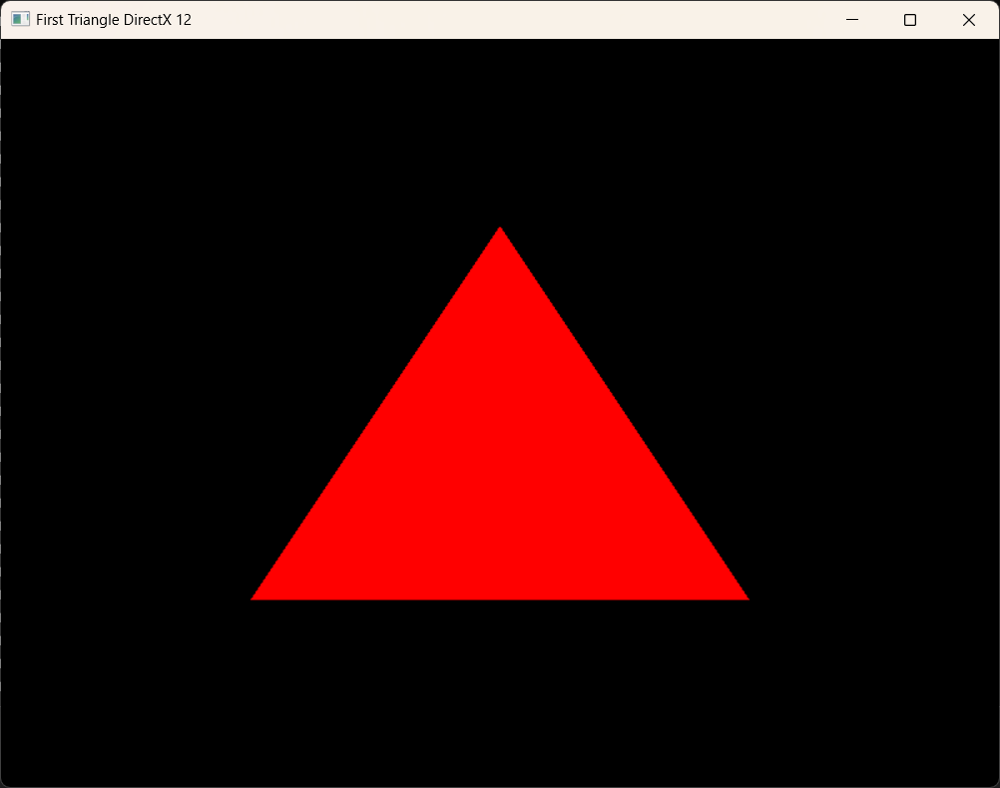

## Screenshots



## Dependencies

- LLVM + Clang Power Tools - for formatting and refactoring the code. Use `.clang-format`.
- SDL - for handling windows creation, events and input.
- SPDLOG - for logging.
- EASTL - for EA optimized standard containers for performance (optional, currently not utilized).
- xxHash - for fast hash computations.
- DirectX 12 related dependencies. It includes:
  - DirectX 12 Agility SDK - for accessing the latest DirectX 12 features.
  - DirectX Shader Compiler - for compiling HLSL shaders to DirectX Intermediate Language (DXIL).
  - Microsoft::DXIL - for working with DirectX Intermediate Language (DXIL).
  - DirectX-Headers - provides the headers for DirectX development.
- vcpkg - for managing and building C++ libraries. (Currently is used for fetching and integrating DX12 related dependencies).
- cmake-modules (FindWindowsSDK) - for locating and integrating the Windows SDK in the project.

## How to Build

I strongly recommend creating a separate build directory and building the project there. This approach makes it easy to clean up build-related files and folders, ensuring that they do not clutter the root directory.

1. **Clone the repository**  
   Open your terminal and clone the repository to your local machine:

   ```bash
   git clone git@github.com:vadymchan/game_engine.git
   ```

2. **Create a build directory** (optional but recommended)  
   It’s a good practice to keep build files separate from source code. Create and navigate to the build directory:

   ```bash
   cd game_engine
   mkdir build
   cd build
   ```

3. **Configure the project using CMake**  
   Configure the project with CMake to generate the necessary build files.  
   If you’re using a command-line interface, simply run:
   ```bash
   cmake ..
   ```
   You can also customize the build by enabling or disabling specific options. For example, to enable DirectX as the rendering API, run:
   ```bash
   cmake -DUSE_DIRECTX=ON ..
   ```

Alternatively, you can use the CMake GUI for a more user-friendly experience:

- Open the CMake GUI.
- Set the source directory to the root of the cloned repository.
- Set the build directory to your preferred location (e.g., `game_engine/build`).
- Click "Configure" and choose your preferred generator (e.g., Visual Studio, Ninja, Unix Makefiles).
- Optionally, you can modify available CMake options. Here's some of them:
  - `USE_VCPKG`: Build the vcpkg (default: ON).
  - `BUILD_SDL`: Build the SDL library (default: ON).
  - `BUILD_SPDLOG`: Build the SPDLOG library (default: ON).
  - `BUILD_MATH_LIBRARY`: Build the Math Library (default: ON).
  - `BUILD_EASTL`: Build the EASTL library (default: ON).
  - `BUILD_XXHASH`: Build the xxHash library (default: ON).
  - `USE_VULKAN`: Use Vulkan for graphics (default: ON).
  - `USE_DIRECTX`: Use DirectX for graphics (default: OFF). **PAY ATTENTION!** This option is **not enabled by default** as DirectX is **not portable**.
  - `USE_DIRECTX_AGILITY`: Fetch DirectX 12 Agility SDK (and DirectX-Headers as dependent library) (default: ON if `USE_DIRECTX` is ON).
  - `USE_DIRECTX_SHADER_COMPILER`: Fetch DirectX Shader Compiler (default: ON if `USE_DIRECTX` is ON).
- Click "Generate" to create the build files.

## naming conventions for this project:

For refactoring naming conventions this project uses **clang-format**.

| Code Element                     | Naming Convention                                 | Example                                  |
| -------------------------------- | ------------------------------------------------- | ---------------------------------------- |
| Classes                          | CamelCase                                         | `GameEngine`                             |
| Structures                       | CamelCase                                         | `Vector2D`                               |
| Unions                           | CamelCase                                         | `DataUnion`                              |
| Functions / Methods              | camelCase with `g_` prefix (for global functions) | `updatePosition()`, `g_initializeGame()` |
| Public Member Variables          | `m_` prefix + camelCase                           | `m_position`                             |
| Private Member Variables         | `m_` prefix + camelCase + `_` postfix             | `m_position_`                            |
| Protected Member Variables       | `m_` prefix + camelCase + `_` postfix             | `m_counter_`                             |
| Public Methods                   | camelCase                                         | `updatePosition()`                       |
| Protected Methods                | camelCase + `_` postfix                           | `run_()`                                 |
| Private Methods                  | camelCase + `_` postfix                           | `initialize_()`                          |
| Enums (both scoped and unscoped) | CamelCase                                         | `Color`                                  |
| Enum Constants                   | CamelCase                                         | `Difficulty::Easy`, `RED`                |
| Namespaces                       | lowercase with underscores                        | `game_logic`                             |
| Interface Classes                | `I` prefix + CamelCase                            | `ICollidable`                            |
| Template Parameters              | CamelCase                                         | `ContainerType`                          |
| Macros                           | UPPER_CASE_WITH_UNDERSCORES                       | `MAX_HEALTH`                             |
| Typedefs and Type Aliases        | CamelCase                                         | `BigInt`                                 |
| Static Constant Member Variables | `s_k` prefix + CamelCase                          | `s_kMaxValue`                            |
| Class Constant Member Variables  | `s_k` prefix + CamelCase                          | `s_kDefaultColor`                        |
| Constants                        | `k` prefix + CamelCase                            | `kMaxPlayers`                            |
| Static Variables                 | `s_` prefix + camelCase                           | `s_instanceCount`                        |
| Global Variables                 | `g_` prefix + camelCase                           | `g_gameState`                            |
| Global Constants                 | `g_k` prefix + CamelCase                          | `g_kInitialSpeed`                        |
| Class Members                    | `s_` prefix + camelCase                           | `s_memberVariable`                       |
| Class Methods                    | `s_` prefix + camelCase                           | `s_classMethod()`                        |
| Template Value                   | camelCase                                         | `defaultValue`                           |
| Type Template                    | CamelCase                                         | `TypeParam`                              |

P.S. for some elements i'm still not sure:

- for class methods do i really need to add `_s` prefix 🤔
- do i need to add `s_k`, `g_k` prefixes 🤔
