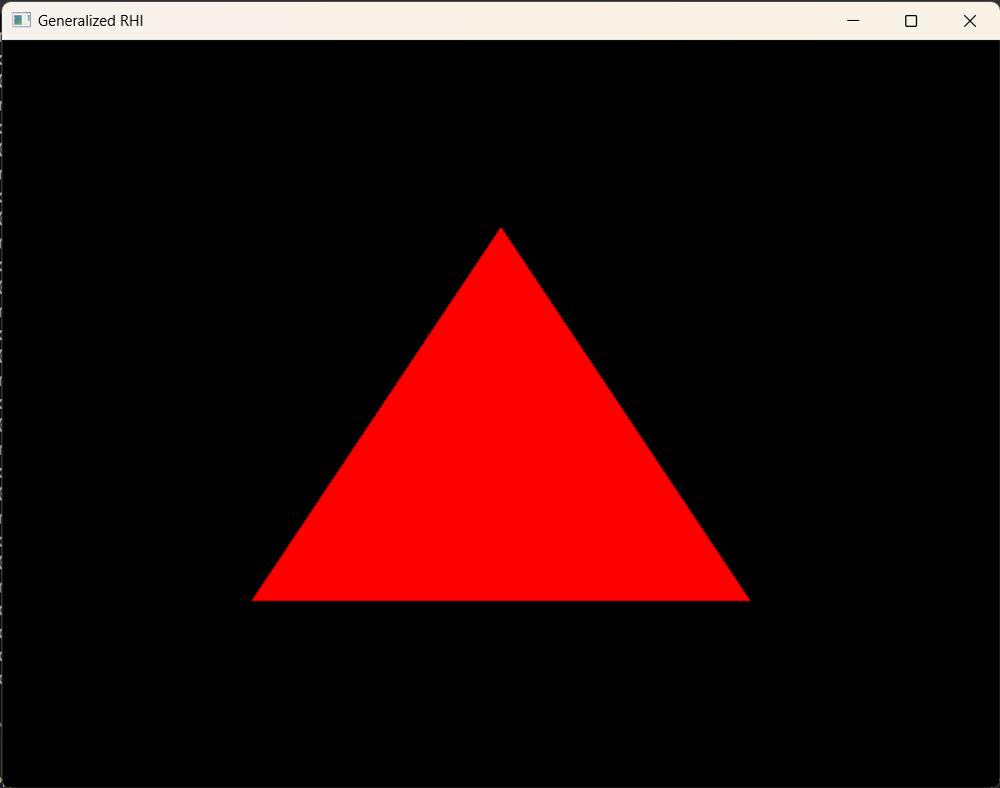

## Screenshots



## Dependencies

- LLVM + Clang Power Tools - for formatting and refactoring the code. Use `.clang-format`.

## Tree hierarchy

```
game_engine
├── assets
│   └── shaders
│       ├── common.hlsli
│       ├── deferred_rendering
│       │   ├── gbuffer.ps.hlsl
│       │   └── gbuffer.vs.hlsl
│       ├── demo
│       │   ├── first_triangle.ps.hlsl
│       │   └── first_triangle.vs.hlsl
│       ├── forward_rendering
│       │   ├── shader.ps.hlsl
│       │   ├── shader.vs.hlsl
│       │   └── shader_instancing.vs.hlsl
│       └── shperical_map.hlsl
├── include
│   └── engine.h
├── screenshots
│   └── first_triangle_vulkan.png
└── src
    ├── engine.cpp
    ├── file_loader
    │   └── file.cpp
    ├── game.cpp
    ├── gfx
    │   ├── renderer
    │   │   ├── draw_command.cpp
    │   │   ├── material.cpp
    │   │   └── primitive_util.cpp
    │   ├── rhi
    │   │   ├── name.cpp
    │   │   └── vulkan
    │   │       ├── buffer_vk.cpp
    │   │       ├── command_buffer_vk.cpp
    │   │       ├── command_pool_vk.cpp
    │   │       ├── descriptor_pool_vk.cpp
    │   │       ├── fence_vk.cpp
    │   │       ├── frame_buffer_pool_vk.cpp
    │   │       ├── frame_buffer_vk.cpp
    │   │       ├── memory_pool_vk.cpp
    │   │       ├── pipeline_state_info_vk.cpp
    │   │       ├── render_frame_context_vk.cpp
    │   │       ├── render_pass_vk.cpp
    │   │       ├── render_target_pool_vk.cpp
    │   │       ├── render_target_vk.cpp
    │   │       ├── rhi_vk.cpp
    │   │       ├── ring_buffer_vk.cpp
    │   │       ├── semaphore_vk.cpp
    │   │       ├── shader_binding_layout_vk.cpp
    │   │       ├── shader_vk.cpp
    │   │       ├── spirv_util.cpp
    │   │       ├── swapchain_vk.cpp
    │   │       ├── texture_vk.cpp
    │   │       ├── uniform_buffer_object_vk.cpp
    │   │       └── utils_vk.cpp
    │   └── scene
    │       ├── camera.cpp
    │       ├── object.cpp
    │       ├── render_object.cpp
    │       └── view.cpp
    ├── internal_include
    │   ├── engine_internal.h
    │   ├── event
    │   │   ├── application_event_handler.h
    │   │   ├── application_event_manager.h
    │   │   ├── event.h
    │   │   ├── event_handler.h
    │   │   ├── keyboard_event_handler.h
    │   │   ├── mouse_event_handler.h
    │   │   ├── window_event_handler.h
    │   │   └── window_event_manager.h
    │   ├── file_loader
    │   │   ├── file.h
    │   │   └── image_file_loader.h
    │   ├── game.h
    │   ├── gfx
    │   │   ├── renderer
    │   │   │   ├── draw_command.h
    │   │   │   ├── material.h
    │   │   │   ├── primitive_util.h
    │   │   │   └── renderer.h
    │   │   ├── rhi
    │   │   │   ├── i_uniform_buffer_block.h
    │   │   │   ├── instant_struct.h
    │   │   │   ├── lock.h
    │   │   │   ├── mem_stack_allocator.h
    │   │   │   ├── name.h
    │   │   │   ├── resource_container.h
    │   │   │   ├── resource_pool.h
    │   │   │   ├── rhi_type.h
    │   │   │   ├── shader_bindable_resource.h
    │   │   │   └── vulkan
    │   │   │       ├── buffer_vk.h
    │   │   │       ├── command_buffer_vk.h
    │   │   │       ├── command_pool_vk.h
    │   │   │       ├── descriptor_pool_vk.h
    │   │   │       ├── feature_switch_vk.h
    │   │   │       ├── fence_vk.h
    │   │   │       ├── frame_buffer_pool_vk.h
    │   │   │       ├── frame_buffer_vk.h
    │   │   │       ├── memory_pool_vk.h
    │   │   │       ├── pipeline_state_info_vk.h
    │   │   │       ├── pipeline_state_info_vk.inl
    │   │   │       ├── render_frame_context_vk.h
    │   │   │       ├── render_pass_vk.h
    │   │   │       ├── render_target_pool_vk.h
    │   │   │       ├── render_target_vk.h
    │   │   │       ├── rhi_type_vk.h
    │   │   │       ├── rhi_vk.h
    │   │   │       ├── ring_buffer_vk.h
    │   │   │       ├── semaphore_vk.h
    │   │   │       ├── shader_binding_instance_combiner.h
    │   │   │       ├── shader_binding_layout_vk.h
    │   │   │       ├── shader_vk.h
    │   │   │       ├── spirv_util.h
    │   │   │       ├── swapchain_vk.h
    │   │   │       ├── texture_vk.h
    │   │   │       ├── uniform_buffer_object_vk.h
    │   │   │       └── utils_vk.h
    │   │   └── scene
    │   │       ├── bound_primitive.h
    │   │       ├── camera.h
    │   │       ├── object.h
    │   │       ├── render_object.h
    │   │       └── view.h
    │   ├── input
    │   │   ├── input_manager.h
    │   │   ├── key.h
    │   │   └── mouse.h
    │   ├── platform
    │   │   └── common
    │   │       └── window.h
    │   └── utils
    │       ├── enum
    │       │   └── enum_util.h
    │       ├── logger
    │       │   ├── console_logger.h
    │       │   ├── global_logger.h
    │       │   └── i_logger.h
    │       ├── math
    │       │   ├── math_util.h
    │       │   └── plane.h
    │       ├── memory
    │       │   └── memory_allocator.h
    │       ├── third_party
    │       │   └── xxhash_util.h
    │       └── time
    │           └── stopwatch.h
    ├── platform
    │   └── common
    │       └── window.cpp
    └── utils
        ├── logger
        │   ├── console_logger.cpp
        │   └── global_logger.cpp
        └── time
            └── stopwatch.cpp
```

## naming conventions for this project:

For refactoring naming conventions this project uses **clang-format**.

| Code Element                     | Naming Convention                                 | Example                                  |
| -------------------------------- | ------------------------------------------------- | ---------------------------------------- |
| Classes                          | CamelCase                                         | `GameEngine`                             |
| Structures                       | CamelCase                                         | `Vector2D`                               |
| Unions                           | CamelCase                                         | `DataUnion`                              |
| Functions / Methods              | camelCase with `g_` prefix (for global functions) | `updatePosition()`, `g_initializeGame()` |
| Public Member Variables          | `m_` prefix + camelCase                           | `m_position`                             |
| Private Member Variables         | `m_` prefix + camelCase + `_` postfix             | `m_position_`                            |
| Protected Member Variables       | `m_` prefix + camelCase + `_` postfix             | `m_counter_`                             |
| Public Methods                   | camelCase                                         | `updatePosition()`                       |
| Protected Methods                | camelCase + `_` postfix                           | `run_()`                                 |
| Private Methods                  | camelCase + `_` postfix                           | `initialize_()`                          |
| Enums (both scoped and unscoped) | CamelCase                                         | `Color`                                  |
| Enum Constants                   | CamelCase                                         | `Difficulty::Easy`, `RED`                |
| Namespaces                       | lowercase with underscores                        | `game_logic`                             |
| Interface Classes                | `I` prefix + CamelCase                            | `ICollidable`                            |
| Template Parameters              | CamelCase                                         | `ContainerType`                          |
| Macros                           | UPPER_CASE_WITH_UNDERSCORES                       | `MAX_HEALTH`                             |
| Typedefs and Type Aliases        | CamelCase                                         | `BigInt`                                 |
| Static Constant Member Variables | `s_k` prefix + CamelCase                          | `s_kMaxValue`                            |
| Class Constant Member Variables  | `s_k` prefix + CamelCase                          | `s_kDefaultColor`                        |
| Constants                        | `k` prefix + CamelCase                            | `kMaxPlayers`                            |
| Static Variables                 | `s_` prefix + camelCase                           | `s_instanceCount`                        |
| Global Variables                 | `g_` prefix + camelCase                           | `g_gameState`                            |
| Global Constants                 | `g_k` prefix + CamelCase                          | `g_kInitialSpeed`                        |
| Class Members                    | `s_` prefix + camelCase                           | `s_memberVariable`                       |
| Class Methods                    | `s_` prefix + camelCase                           | `s_classMethod()`                        |
| Template Value                   | camelCase                                         | `defaultValue`                           |
| Type Template                    | CamelCase                                         | `TypeParam`                              |

P.S. for some elements i'm still not sure:

- for class methods do i really need to add `_s` prefix 🤔
- do i need to add `s_k`, `g_k` prefixes 🤔
